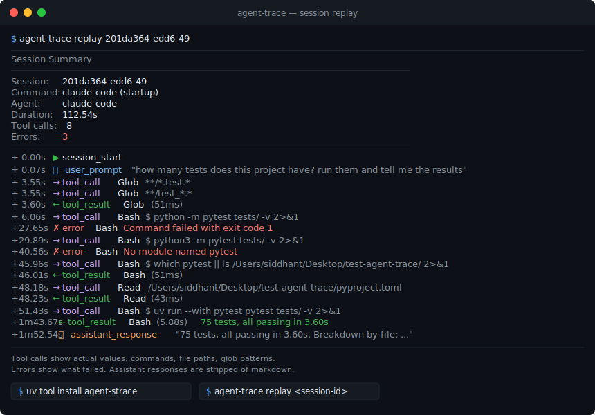

# agent-trace

[](https://app.ona.com/#https://github.com/Siddhant-K-code/agent-trace)
[](https://pypi.org/project/agent-strace/)
[](https://pypi.org/project/agent-strace/)
[](LICENSE)
[](https://github.com/Siddhant-K-code/agent-trace/actions/workflows/test.yml)
[](https://open-vsx.org/extension/Siddhant-K-code/agent-strace)

`strace` for AI agents. Capture and replay every tool call, prompt, and response from Claude Code, Cursor, or any MCP client — then analyse, diff, audit, and share what happened.



## Why

A coding agent rewrites 20 files in a background session. You get a pull request. You do not get the story. Which files did it read first? Why did it call the same tool three times? What failed before it found the fix?

Most tools trace LLM calls. That is one layer. The gap is everything around it: tool calls, file operations, decision points, error recovery, the actual commands the agent ran. `agent-strace` captures the full session and lets you replay it later. Export to Datadog, Honeycomb, New Relic, or Splunk when you need production observability.

## Install

```bash
# With uv (recommended)
uv tool install agent-strace

# Or with pip
pip install agent-strace

# Or run without installing
uvx agent-strace replay
```

**Zero dependencies.** Python 3.10+ standard library only.

## VS Code / Cursor extension

Install the **agent-strace** extension to see live session activity without leaving the editor.

**Install:**
- Search `agent-strace` in the Extensions panel (VS Code, Cursor, or any Open VSX-compatible editor)
- Or install from [open-vsx.org/extension/Siddhant-K-code/agent-strace](https://open-vsx.org/extension/Siddhant-K-code/agent-strace)

**What you get:**

| Feature | Description |
|---|---|
| Status bar | Live cost, tool call count, and active tool name. Click to open the event stream. |
| Gutter annotations | Blue border on files the agent read, amber on files it modified. Inline label shows read/write counts. |
| Event stream panel | Live feed in the Explorer sidebar — every tool call, file op, LLM request, and error. |
| Pause button | Stops the agent mid-session via SIGSTOP. Requires `agent-strace watch` running in a terminal. |

**Setup:**

```bash
# 1. Install agent-strace
pip install agent-strace

# 2. Add hooks to Claude Code (one-time)
agent-strace setup

# 3. Open your project in VS Code / Cursor
# The extension activates automatically when .agent-traces/ exists

# 4. Start Claude Code — the status bar item appears immediately
```

The extension activates automatically when a `.agent-traces/` directory exists in the workspace root. No configuration required.

**Pause / resume** (optional — requires watch running):

```bash
# In a separate terminal, start the watcher
agent-strace watch

# Then use the Pause button in the event stream panel,
# or run: agent-trace: Pause Agent from the command palette
```

## Quick start

### Option 1: Claude Code hooks (full session capture)

Captures everything: user prompts, assistant responses, and every tool call (Bash, Edit, Write, Read, Agent, Grep, Glob, WebFetch, WebSearch, all MCP tools).

```bash
agent-strace setup        # prints hooks config JSON
agent-strace setup --global  # for all projects
```

Add the output to `.claude/settings.json`. Or paste it manually:

```json
{
  "hooks": {
    "UserPromptSubmit": [{ "hooks": [{ "type": "command", "command": "agent-strace hook user-prompt" }] }],
    "PreToolUse": [{ "matcher": "", "hooks": [{ "type": "command", "command": "agent-strace hook pre-tool" }] }],
    "PostToolUse": [{ "matcher": "", "hooks": [{ "type": "command", "command": "agent-strace hook post-tool" }] }],
    "PostToolUseFailure": [{ "matcher": "", "hooks": [{ "type": "command", "command": "agent-strace hook post-tool-failure" }] }],
    "Stop": [{ "hooks": [{ "type": "command", "command": "agent-strace hook stop" }] }],
    "SessionStart": [{ "hooks": [{ "type": "command", "command": "agent-strace hook session-start" }] }],
    "SessionEnd": [{ "hooks": [{ "type": "command", "command": "agent-strace hook session-end" }] }]
  }
}
```

Then use Claude Code normally.

```bash
agent-strace list     # list sessions
agent-strace replay   # replay the latest
agent-strace explain  # plain-English summary of what the agent did
agent-strace stats    # tool call frequency and timing
```

### Option 2: MCP proxy (any MCP client)

Wraps any MCP server. Works with Cursor, Windsurf, or any MCP client.

```bash
agent-strace record -- npx -y @modelcontextprotocol/server-filesystem /tmp
agent-strace replay
```

### Option 3: Python decorator

Wraps your tool functions directly. No MCP required.

```python
from agent_trace import trace_tool, trace_llm_call, start_session, end_session, log_decision

start_session(name="my-agent")  # add redact=True to strip secrets

@trace_tool
def search_codebase(query: str) -> str:
    return search(query)

@trace_llm_call
def call_llm(messages: list, model: str = "claude-4") -> str:
    return client.chat(messages=messages, model=model)

# Log decision points explicitly
log_decision(
    choice="read_file_first",
    reason="Need to understand current implementation before making changes",
    alternatives=["read_file_first", "search_codebase", "write_fix_directly"],
)

search_codebase("authenticate")
call_llm([{"role": "user", "content": "Fix the bug"}])

meta = end_session()
print(f"Replay with: agent-strace replay {meta.session_id}")
```

## CLI commands

```
agent-strace setup [--redact] [--global]        Generate Claude Code hooks config
agent-strace hook <event>                       Handle a Claude Code hook event (internal)
agent-strace record -- <command>                Record an MCP stdio server session
agent-strace record-http <url> [--port N]       Record an MCP HTTP/SSE server session
agent-strace replay [session-id]                Replay a session (default: latest)
agent-strace replay --format html [-o file]     Export a self-contained HTML replay viewer
agent-strace replay --expand-subagents          Inline subagent sessions under parent tool_call
agent-strace replay --tree                      Show session hierarchy without full replay
agent-strace list                               List all sessions
agent-strace explain [session-id]               Explain a session in plain English
agent-strace stats [session-id]                 Show tool call frequency and timing
agent-strace stats --include-subagents          Roll up stats across the full subagent tree
agent-strace inspect <session-id>               Dump full session as JSON
agent-strace export <session-id>                Export as JSON, CSV, NDJSON, or OTLP
agent-strace import <session.jsonl>             Import a Claude Code JSONL session log
agent-strace cost [session-id]                  Estimate token cost for a session
agent-strace diff <session-a> <session-b>       Compare two sessions structurally
agent-strace diff --compare <a> <b>             Side-by-side table with verdict
agent-strace diff --semantic <a> <b>            Compare sessions by outcome, not event order
agent-strace why [session-id] <event-number>    Trace the causal chain for an event
agent-strace audit [session-id] [--policy]      Check tool calls against a policy file
agent-strace audit-tools [--repo .] [--approved] Scan a repo for shadow AI tool usage
agent-strace policy [--output file]             Generate .agent-scope.json from observed traces
agent-strace dashboard [--last N] [--html file] Aggregate stats and trends across sessions
agent-strace annotate <session-id> <offset>     Add notes, labels, or bookmarks to events
agent-strace token-budget <session-id>          Check token usage against model context limit
agent-strace watch [--rules file]               Watch a live session; kill/pause on rule breach
agent-strace share <session-id> [-o file]       Export a self-contained HTML report
agent-strace standup [--session id]             Standup report from session trace (no LLM)
agent-strace freshness [--scope glob]           Context freshness check vs last session
agent-strace oncall --rotation-start DATE       On-call readiness for agent-modified files
agent-strace curve [--export csv]               Personal agent cost-efficiency curve
agent-strace inflation [--compare m1,m2]        Token inflation calculator across model versions
agent-strace a2a-tree [session-id]              Visualise A2A agent call graph
```

### Import existing Claude Code sessions

Already ran a session without hooks? Import it directly from Claude Code's native JSONL logs:

```bash
# Discover available sessions
agent-strace import --discover

# Import a specific session
agent-strace import ~/.claude/projects/<project>/<session-id>.jsonl

# Then use it like any captured session
agent-strace replay <session-id>
agent-strace explain <session-id>
agent-strace stats <session-id>
```

Claude Code stores session logs in `~/.claude/projects/`. The import captures tool calls, token usage, subagent invocations, and session metadata.

### Explain a session

Get a plain-English breakdown of what the agent did, organized by phase, with retry and wasted-time detection:

```bash
agent-strace explain           # latest session
agent-strace explain abc123    # specific session
```

```
Session: abc123 (2m 05s, 47 events)

Phase 1: fix the auth module (0:00–0:05, 5 events)
  Read: AGENTS.md, src/auth.py

Phase 2: run tests — FAILED (0:05–1:20, 12 events)
  Ran: python -m pytest
  Ran: python -m pytest  ← retry

Phase 3: run tests (1:20–2:05, 8 events)
  Ran: uv run pytest

Files touched: 3 read, 0 written
Retries: 1 (wasted 1m 15s, 60% of session)
```

### Estimate cost

Break down estimated token usage and dollar cost by phase. Flags wasted spend on failed phases.

```bash
agent-strace cost                          # latest session, sonnet pricing
agent-strace cost abc123 --model opus      # specific session and model
agent-strace cost abc123 --input-price 3.0 --output-price 15.0  # custom pricing
```

```
Session: abc123 — Estimated cost: $0.0042
Model: sonnet  |  8,200 input tokens, 3,100 output tokens

  Phase 1: fix the auth module          $0.0008  (19%)  ...
  Phase 2: run tests — FAILED           $0.0021  (50%)  ...  ← wasted
  Phase 3: run tests                    $0.0013  (31%)  ...

Wasted on failed phases: $0.0021 (50%)
```

Supported models: `sonnet` (default), `opus`, `haiku`, `gpt4`, `gpt4o`. Token counts are estimated from payload size (`len / 4`); see [ADR-0008](ADRs/0008-token-cost-estimation-heuristic.md) for details.

See [examples/session_analysis.md](examples/session_analysis.md) for a full walkthrough combining `import`, `explain`, and `cost`.

### Secret redaction

Pass `--redact` to strip API keys, tokens, and credentials from traces before they hit disk.

```bash
# Stdio proxy with redaction
agent-strace record --redact -- npx -y @modelcontextprotocol/server-filesystem /tmp

# HTTP proxy with redaction
agent-strace record-http https://mcp.example.com --redact
```

Detected patterns: OpenAI (`sk-*`), GitHub (`ghp_*`, `github_pat_*`), AWS (`AKIA*`), Anthropic (`sk-ant-*`), Slack (`xox*`), JWTs, Bearer tokens, connection strings (`postgres://`, `mysql://`), and any value under keys like `password`, `secret`, `token`, `api_key`, `authorization`.

### HTTP/SSE proxy

For MCP servers that use HTTP transport instead of stdio:

```bash
# Proxy a remote MCP server
agent-strace record-http https://mcp.example.com --port 3100

# Your agent connects to http://127.0.0.1:3100 instead of the remote server
# All JSON-RPC messages are captured, tool call latency is measured
```

The proxy forwards POST `/message` and GET `/sse` to the remote server, capturing every JSON-RPC message in both directions.

### Replay output

A real Claude Code session captured with hooks:

<details><summary>Session Summary</summary>
<p>

```
Session Summary
──────────────────────────────────────────────────
  Session:    201da364-edd6-49
  Command:    claude-code (startup)
  Agent:      claude-code
  Duration:   112.54s
  Tool calls: 8
  Errors:     3
──────────────────────────────────────────────────

+  0.00s ▶ session_start
+  0.07s 👤 user_prompt
              "how many tests does this project have? run them and tell me the results"
+  3.55s → tool_call Glob
              **/*.test.*
+  3.55s → tool_call Glob
              **/test_*.*
+  3.60s ← tool_result Glob (51ms)
+  6.06s → tool_call Bash
              $ python -m pytest tests/ -v 2>&1
+ 27.65s ✗ error Bash
              Command failed with exit code 1
+ 29.89s → tool_call Bash
              $ python3 -m pytest tests/ -v 2>&1
+ 40.56s ✗ error Bash
              No module named pytest
+ 45.96s → tool_call Bash
              $ which pytest || ls /Users/siddhant/Desktop/test-agent-trace/ 2>&1
+ 46.01s ← tool_result Bash (51ms)
+ 48.18s → tool_call Read
              /Users/siddhant/Desktop/test-agent-trace/pyproject.toml
+ 48.23s ← tool_result Read (43ms)
+ 51.43s → tool_call Bash
              $ uv run --with pytest pytest tests/ -v 2>&1
+1m43.67s ← tool_result Bash (5.88s)
              75 tests, all passing in 3.60s
+1m52.54s 🤖 assistant_response
              "75 tests, all passing in 3.60s. Breakdown by file: ..."
```

Tool calls show actual values: commands, file paths, glob patterns. Errors show what failed. Assistant responses are stripped of markdown.

</p>
</details> 

### Filtering

```bash
# Show only tool calls and errors
agent-strace replay --filter tool_call,error

# Replay with timing (watch it unfold)
agent-strace replay --live --speed 2
```

### Export

```bash
# JSON array
agent-strace export a84664 --format json

# CSV (for spreadsheets)
agent-strace export a84664 --format csv

# NDJSON (for streaming pipelines)
agent-strace export a84664 --format ndjson
```

## Trace format

Traces are stored as directories in `.agent-traces/`:

```
.agent-traces/
  a84664242afa4516/
    meta.json        # session metadata
    events.ndjson    # newline-delimited JSON events
```

Each event is a single JSON line:

```json
{
  "event_type": "tool_call",
  "timestamp": 1773562735.09,
  "event_id": "bf1207728ee6",
  "session_id": "a84664242afa4516",
  "data": {
    "tool_name": "read_file",
    "arguments": {"path": "src/auth.py"}
  }
}
```

### Event types

| Type | Description |
|------|-------------|
| `session_start` | Trace session began |
| `session_end` | Trace session ended |
| `user_prompt` | User submitted a prompt to the agent |
| `assistant_response` | Agent produced a text response |
| `tool_call` | Agent invoked a tool |
| `tool_result` | Tool returned a result |
| `llm_request` | Agent sent a prompt to an LLM |
| `llm_response` | LLM returned a completion |
| `file_read` | Agent read a file |
| `file_write` | Agent wrote a file |
| `decision` | Agent chose between alternatives |
| `error` | Something failed |

Events link to each other. A `tool_result` has a `parent_id` pointing to its `tool_call`. This lets you measure latency per tool and trace the full call chain.

## Use with Claude Code, Cursor, Windsurf

### Claude Code (hooks, recommended)

Captures the full session: prompts, responses, and every tool call. See [examples/claude_code_config.md](examples/claude_code_config.md) for the full config.

```bash
agent-strace setup                    # per-project config
agent-strace setup --redact --global  # all projects, with secret redaction
```

### Cursor

Edit `~/.cursor/mcp.json` (global) or `.cursor/mcp.json` (per-project):

```json
{
  "mcpServers": {
    "filesystem": {
      "command": "agent-strace",
      "args": ["record", "--name", "filesystem", "--", "npx", "-y", "@modelcontextprotocol/server-filesystem", "/tmp"]
    }
  }
}
```

### Windsurf

Edit `~/.codeium/windsurf/mcp_config.json`:

```json
{
  "mcpServers": {
    "filesystem": {
      "command": "agent-strace",
      "args": ["record", "--name", "filesystem", "--", "npx", "-y", "@modelcontextprotocol/server-filesystem", "/tmp"]
    }
  }
}
```

### Any MCP client

The pattern is the same for any tool that uses MCP over stdio:

1. Replace the server `command` with `agent-strace`
2. Prepend `record --name <label> --` to the original args
3. Use the tool normally
4. Run `agent-strace replay` to see what happened

See the [examples/](examples/) directory for full config files.

### Subagent tracing

When an agent spawns subagents (e.g. Claude Code's Agent tool), sessions are linked into a parent-child tree. Replay the full tree inline or view a compact hierarchy:

```bash
# Inline replay: subagent events appear under the parent tool_call that spawned them
agent-strace replay --expand-subagents

# Compact hierarchy: session IDs, durations, tool counts
agent-strace replay --tree

# Aggregated stats across the full tree (tokens, tool calls, errors)
agent-strace stats --include-subagents
```

```
▶ session_start  a84664242afa  agent=claude-code  depth=0
  + 0.00s  👤 "refactor the auth module"
  + 1.23s  → tool_call  Agent  "extract helper functions"
│  ▶ session_start  b12345678901  agent=claude-code  depth=1
│    + 0.00s  → tool_call  Read  src/auth.py
│    + 0.12s  ← tool_result
│    + 0.45s  → tool_call  Write  src/auth_helpers.py
│    + 0.51s  ■ session_end
  + 3.10s  ← tool_result
  + 3.20s  ■ session_end
```

Subagent sessions are linked via `parent_session_id` and `parent_event_id` in session metadata. Existing sessions without these fields are unaffected.

### Session diff

Compare two sessions structurally. Useful for understanding why the same prompt produces different results across runs, or comparing a broken session against a known-good one. Phases are aligned by label using LCS, then per-phase differences in files touched, commands run, and outcomes are reported:

```bash
agent-strace diff abc123 def456
```

```
Comparing: abc123 vs def456

Diverged at phase 2:

  Phase 2: run tests
    abc123 only:  $ python -m pytest
    def456 only:  $ uv run pytest

  abc123: 4m 12s, 47 events, 8 tools, 2 retries
  def456: 2m 05s, 31 events, 5 tools, 0 retries
```

### Causal chain (why)

Trace backwards from any event to find what caused it. Run `agent-strace replay <session-id>` first — the `#N` numbers in the left column are the event numbers:

```bash
agent-strace why abc123 4
```

```
Why did event #4 happen?

  #  4  tool_call: Bash  $ pytest tests/

Causal chain (root → target):

    #  1  user_prompt: "run the test suite"
       (prompt at #1 triggered this)
  ←  #  3  error: exit 1
       (retry after error at #3)
  ←  #  4  tool_call: Bash  $ pytest tests/
```

Causal links are detected via `parent_id` (tool_result → tool_call), error→retry matching (same tool and command), path references (tool_result text containing a path used by a later call), and read→write pairs on the same file.

### Permission audit

Check every tool call in a session against a policy file. Auto-flags sensitive file access (`.env`, `*.pem`, `.ssh/*`, `.github/workflows/*`, etc.) even without a policy:

```bash
agent-strace audit                          # latest session, no policy required
agent-strace audit abc123 --policy .agent-scope.json

# In CI: fail the build if the agent accessed anything outside policy
agent-strace audit --policy .agent-scope.json || exit 1
```

```
AUDIT: Session abc123 (47 events, 23 tool calls)

✅ Allowed (19):
  Read src/auth.py
  Ran: uv run pytest

⚠️  No policy (2):
  Read README.md  (no file read policy for this path)

❌ Violations (2):
  Read .env  ← denied by files.read.deny
  Ran: curl https://example.com  ← denied by commands.deny

🔐 Sensitive files accessed (1):
  Read .env  (event #12)
```

Exits with code 1 when violations are found — usable in CI.

**Policy file** (`.agent-scope.json`):

```json
{
  "files": {
    "read":  { "allow": ["src/**", "tests/**"], "deny": [".env"] },
    "write": { "allow": ["src/**"], "deny": [".github/**"] }
  },
  "commands": {
    "allow": ["pytest", "uv run", "cat"],
    "deny":  ["curl", "wget", "rm -rf"]
  },
  "network": { "deny_all": true, "allow": ["localhost"] }
}
```

Glob patterns support `**` as a recursive wildcard. File read policy applies to `Read`, `View`, `Grep`, and `Glob` tool calls. Network policy checks URLs embedded in `Bash` commands.

### Auto-generate a policy from your traces

Instead of writing `.agent-scope.json` by hand, let agent-trace observe a few sessions and generate one for you:

```bash
# Dry-run: print the suggested policy without writing anything
agent-strace policy

# Write it to disk
agent-strace policy --output .agent-scope.json

# Observe a specific set of sessions
agent-strace policy --last 20 --output .agent-scope.json
```

The generated policy covers every file path and command the agent actually used, collapsed into glob patterns. Review it, tighten the deny list, then commit it alongside your code.

### PII masking

Sensitive data is masked before it hits disk. Useful when tracing agents that handle user data, credentials, or anything you wouldn't want in a log file.

```bash
# Stdio proxy with masking
agent-strace record --mask -- npx -y @modelcontextprotocol/server-filesystem /tmp

# HTTP proxy with masking
agent-strace record-http https://mcp.example.com --mask
```

Masked by default: email addresses, phone numbers, credit card numbers, US Social Security Numbers, and AWS ARNs. You can also call `mask_event_data()` directly to sanitise events from an existing session before sharing or exporting them.

### Multi-session dashboard

Get an aggregate view across all your sessions — useful for spotting trends, outliers, and cost spikes without opening each session individually.

```bash
agent-strace dashboard                    # all sessions
agent-strace dashboard --last 20          # last 20 sessions
agent-strace dashboard --since 2024-06-01 # since a date
agent-strace dashboard --html report.html # self-contained HTML export
```

The terminal view shows total tool calls, errors, tokens, and estimated cost, plus ASCII sparkline charts for each metric over time and a top-tools frequency table. The HTML export is self-contained — no server needed.

### Session attribution

Every session records who and what spawned it. When you open a trace you'll see the OS user, the detected agent provider, the git repo and branch, and the chain of parent processes.

```bash
agent-strace show SESSION_ID
# Attribution
#   User:     alice
#   Provider: claude-code
#   Branch:   feat/my-feature
#   Commit:   a1b2c3d
#   CWD:      /home/alice/projects/myapp
```

Detected providers: `claude-code`, `cursor`, `github-copilot`, `cody`, `continue`, and a generic `mcp-client` fallback. Attribution is collected automatically — nothing to configure.

### Replay annotations

Add notes, labels, and bookmarks to any event in a recorded session. Useful for code review, debugging, and building eval datasets.

```bash
# Add a note to event #12
agent-strace annotate SESSION_ID 12 --note "Why did it call bash here instead of write_file?"

# Tag an event
agent-strace annotate SESSION_ID 12 --label regression

# Bookmark for quick navigation in the HTML viewer
agent-strace annotate SESSION_ID 12 --bookmark

# List all annotations
agent-strace annotate SESSION_ID --list

# Remove one
agent-strace annotate SESSION_ID 12 --delete ANNOTATION_ID
```

Annotations persist alongside the session and appear as a bookmarks sidebar in shared HTML reports. They're also useful for building eval datasets — label sessions as `pass` / `fail` / `interesting` and filter on those labels later.

### Token budget tracking

Long-running agents can silently burn through a model's context window. The token budget command shows how close you are and warns before you hit the limit.

```bash
agent-strace token-budget SESSION_ID
agent-strace token-budget SESSION_ID --model claude-3-5-sonnet
agent-strace token-budget SESSION_ID --model gpt-4o --warn-at 75
```

In watch mode, the same threshold applies in real time:

```bash
agent-strace watch --max-context-pct 80 SESSION_ID
```

Supported models and their limits:

| Model | Context |
|---|---|
| claude-3-5-sonnet | 200k tokens |
| claude-3-opus | 200k tokens |
| gpt-4o | 128k tokens |
| gpt-4-turbo | 128k tokens |
| gemini-1.5-pro | 1M tokens |

Pass `--limit` to set a custom ceiling for any other model.

### Semantic session diff

Compare two sessions by *outcome* rather than raw event order. Useful for regression testing agent behaviour across model versions or prompt changes.

```bash
agent-strace diff SESSION_A SESSION_B --semantic
```

```
Semantic diff: SESSION_A vs SESSION_B

Tools added:    write_file
Tools removed:  bash
Δ tool calls:   +3
Δ errors:       -2
Δ tokens:       +1,200
Outcome:        improved (fewer errors, same task completed)
```

Export a structured JSON report for CI assertions:

```bash
agent-strace diff SESSION_A SESSION_B --semantic --eval-config eval.json
```

### Rich side-by-side comparison

`--compare` produces a structured table across cost, duration, tool calls, redundant reads, context resets, files modified, and errors — with a deterministic verdict requiring no LLM.

```bash
agent-strace diff SESSION_A SESSION_B --compare
```

New metrics: **redundant reads** (files read more than once), **context resets** (LLM requests separated by >120s), **approach divergence** (first phase pairs where behaviour differs). Useful for asserting on in CI.

### Kill switch for runaway sessions

Add a declarative rules file to `agent-strace watch` to pause, kill, or alert when a session crosses a threshold.

```bash
agent-strace watch --rules .watch-rules.json
agent-strace watch --rules .watch-rules.json --dry-run  # evaluate without acting
```

**Rule conditions:** `files_modified`, `cost_usd`, `consecutive_test_failures`, `duration_minutes`, `file_path` (glob).

**Actions:**
- `pause` — SIGSTOP the agent process (resume with SIGCONT)
- `kill` — SIGTERM, then SIGKILL after 5s; auto-generates a postmortem
- `alert` — log only, no interruption

### Shadow AI detection

Scan a repository for AI tool usage signatures — no network calls, no API keys.

```bash
agent-strace audit-tools
agent-strace audit-tools --repo . --since "90 days ago" --approved cursor,copilot
```

Detected tools: Claude Code, Cursor, GitHub Copilot, Codex/ChatGPT, Windsurf, Aider — identified via file signals (`.cursorrules`, `CLAUDE.md`, `.github/copilot-instructions.md`, etc.) and commit message patterns. Flags unapproved tools, unknown LLM API endpoints in `.env` history, and PII patterns in recently committed files.

### HTML session replay viewer

Generate a single-file HTML viewer for any session. No server, no dependencies — open in any browser.

```bash
agent-strace replay --format html
agent-strace replay --format html --output review.html SESSION_ID
```

The viewer includes an animated event timeline, scrubber bar, running cost counter, click-to-expand event detail, color-coded event types, and dark theme. All event data is embedded as a JSON constant — useful for attaching to PR reviews.

### Standup report

Generate a structured standup from a session trace — no LLM call required.

```bash
agent-strace standup
agent-strace standup --session SESSION_ID
```

Report covers: files read and modified, approaches tried (including abandoned ones detected from retry patterns), new dependencies added, TODO/FIXME comments written, large changes and auth/migration patterns to review, and session stats (tool calls, retries, errors).

### Context freshness check

Before handing a task to an agent, check how stale its last view of the codebase is.

```bash
agent-strace freshness
agent-strace freshness --since 2026-04-01 --scope "src/**"
```

Reports files changed since the last session, per-file change type and line count, a freshness score 0–100, and estimated catch-up reading time. Scope is auto-detected from `CLAUDE.md` / `AGENTS.md`, or overridden with `--scope`.

### On-call readiness

Cross-reference agent-modified files against git history to surface cognitive gaps before a rotation.

```bash
agent-strace oncall --rotation-start 2026-04-25
agent-strace oncall --rotation-start 2026-04-25 --scope "src/payments/**"
```

For each file the agent has written in the last N days: how long ago it was modified, lines changed, estimated reading time, and total catch-up time before rotation.

### Cost-efficiency curve

Analyse stored session history to see which task types are worth delegating to an agent.

```bash
agent-strace curve
agent-strace curve --min-sessions 10 --export csv
```

Sessions are classified into 10 task types (unit tests, debugging, refactoring, architecture, etc.) and compared against a community sweet-spot benchmark. Verdict per type: **efficient / over sweet spot / do this yourself**. Potential monthly savings are calculated for types running above 1.5× their sweet spot.

### Token inflation calculator

Measure the tokenizer cost impact of switching model versions before committing to an upgrade — no API calls required.

```bash
agent-strace inflation
agent-strace inflation --compare claude-opus-4-6,claude-opus-4-7 --sessions 30
```

Applies per-model inflation factors to stored session content and breaks down the impact by content type (system prompt, tool definitions, user messages, assistant messages). Projects per-session, daily, and monthly cost delta.

| Model | Factor |
|---|---|
| claude-opus-4-7 | 1.38× (community median: 1.3–1.47×, April 2026) |
| gpt-4o | 1.05× (cl100k_base → o200k_base) |

### A2A protocol support

First-class support for agent-to-agent calls following the Google A2A spec. A2A calls are captured as `TOOL_CALL` events with `event_subtype=a2a_call` — backward-compatible with all existing replay and export tooling.

```bash
agent-strace a2a-tree
agent-strace a2a-tree SESSION_ID --format json
```

Builds the full agent call graph by following `sub_session_id` links and `parent_session_id` back-references. Renders as an ASCII tree or exports as OTLP-compatible spans for Jaeger, Tempo, or any OpenTelemetry backend.

## Production tracing (OTLP export)

Export sessions as OpenTelemetry spans to your existing observability stack. Sessions become traces. Tool calls become spans with duration and inputs. Errors get exception events. Zero new dependencies.

### Datadog

```bash
# Via the Datadog Agent's OTLP receiver (port 4318)
agent-strace export <session-id> --format otlp \
  --endpoint http://localhost:4318

# Or via Datadog's OTLP intake directly
agent-strace export <session-id> --format otlp \
  --endpoint https://http-intake.logs.datadoghq.com:443 \
  --header "DD-API-KEY: $DD_API_KEY"
```

### Honeycomb

```bash
agent-strace export <session-id> --format otlp \
  --endpoint https://api.honeycomb.io \
  --header "x-honeycomb-team: $HONEYCOMB_API_KEY" \
  --service-name my-agent
```

### New Relic

```bash
agent-strace export <session-id> --format otlp \
  --endpoint https://otlp.nr-data.net \
  --header "api-key: $NEW_RELIC_LICENSE_KEY"
```

### Splunk

```bash
agent-strace export <session-id> --format otlp \
  --endpoint https://ingest.<realm>.signalfx.com \
  --header "X-SF-Token: $SPLUNK_ACCESS_TOKEN"
```

### Grafana Tempo / Jaeger

```bash
# Local collector
agent-strace export <session-id> --format otlp \
  --endpoint http://localhost:4318
```

### Dump OTLP JSON without sending

```bash
# Inspect the OTLP payload
agent-strace export <session-id> --format otlp > trace.json
```

### How it maps

| agent-trace | OpenTelemetry |
|---|---|
| session | trace |
| tool_call + tool_result | span (with duration) |
| error | span with error status + exception event |
| user_prompt | event on root span |
| assistant_response | event on root span |
| session_id | trace ID |
| event_id | span ID |
| parent_id | parent span ID |

## How it works

### Claude Code hooks

```
Claude Code agentic loop
  ├── UserPromptSubmit   → agent-strace hook user-prompt
  ├── PreToolUse         → agent-strace hook pre-tool
  ├── PostToolUse        → agent-strace hook post-tool
  ├── PostToolUseFailure → agent-strace hook post-tool-failure
  ├── Stop               → agent-strace hook stop
  ├── SessionStart       → agent-strace hook session-start
  └── SessionEnd         → agent-strace hook session-end
                               ↓
                         .agent-traces/
```

Claude Code fires hook events at every stage of its agentic loop. agent-strace registers as a handler, reads JSON from stdin, and writes trace events. Each hook runs as a separate process. Session state lives in `.agent-traces/.active-session` so PreToolUse and PostToolUse can be correlated for latency measurement.

### MCP stdio proxy

```
Agent ←→ agent-strace proxy ←→ MCP Server (stdio)
              ↓
         .agent-traces/
```

The proxy reads JSON-RPC messages (Content-Length framed or newline-delimited), classifies each one, and writes a trace event. Messages are forwarded unchanged. The agent and server do not know the proxy exists.

### MCP HTTP/SSE proxy

```
Agent ←→ agent-strace proxy (localhost:3100) ←→ Remote MCP Server (HTTPS)
              ↓
         .agent-traces/
```

Same idea, different transport. Listens on a local port, forwards POST and SSE requests to the remote server, captures every JSON-RPC message in both directions.

### Decorator mode

```python
@trace_tool
def my_function(x):
    return x * 2
```

The decorator logs a `tool_call` event before execution and a `tool_result` after. Errors and timing are captured automatically.

### Secret redaction

When `--redact` is enabled (or `redact=True` in the decorator API), trace events pass through a redaction filter before hitting disk. The filter checks key names (`password`, `api_key`) and value patterns (`sk-*`, `ghp_*`, JWTs). Redacted values become `[REDACTED]`. The original data is never stored.

## Project structure

```
src/agent_trace/
  __init__.py       # version
  models.py         # TraceEvent, SessionMeta, EventType
  store.py          # NDJSON file storage
  hooks.py          # Claude Code hooks integration
  proxy.py          # MCP stdio proxy
  http_proxy.py     # MCP HTTP/SSE proxy
  redact.py         # secret redaction (key/value pattern matching)
  masking.py        # PII masking (email, phone, CC, SSN, ARN)
  otlp.py           # OTLP/HTTP JSON exporter with GenAI semantic conventions
  replay.py         # terminal replay, HTML viewer export
  decorator.py      # @trace_tool, @trace_llm_call, log_decision
  jsonl_import.py   # Claude Code JSONL session import
  explain.py        # session phase detection and plain-English summary
  cost.py           # token and cost estimation
  subagent.py       # parent-child session tree, tree replay, stats rollup
  diff.py           # structural, semantic, and side-by-side session comparison
  why.py            # causal chain tracing (backwards event walk)
  audit.py          # policy-based tool call checking, sensitive file detection
  audit_tools.py    # shadow AI detection (file signals + commit patterns)
  policy.py         # generate .agent-scope.json from observed traces
  attribution.py    # session attribution (user, process ancestry, git context)
  dashboard.py      # multi-session aggregate view and trend charts
  annotate.py       # replay annotations (notes, labels, bookmarks)
  token_budget.py   # token budget tracking and context window early warning
  watch.py          # live session watcher with rule-based kill switch
  share.py          # self-contained HTML report export
  standup.py        # standup report from session trace (no LLM)
  freshness.py      # context freshness check vs last session
  oncall.py         # on-call readiness for agent-modified files
  curve.py          # personal agent cost-efficiency curve
  inflation.py      # token inflation calculator across model versions
  a2a.py            # A2A protocol support and cross-agent trace correlation
  cli.py            # CLI entry point
ADRs/               # Architecture Decision Records
```

## Running tests

```bash
pytest
```

## Development

```bash
git clone https://github.com/Siddhant-K-code/agent-trace.git
cd agent-trace

# Run tests
pytest

# Run the example
PYTHONPATH=src python examples/basic_agent.py

# Replay the example
PYTHONPATH=src python -m agent_trace.cli replay

# Build the package
uv build

# Install locally for testing
uv tool install -e .
```

## Related

- [Architecture Decision Records](ADRs/) - design decisions and their rationale
- [The agent observability gap (blog)](https://siddhantkhare.com/writing/agent-observability-gap) - the problem this tool addresses
- [The agent observability gap (thread)](https://x.com/Siddhant_K_code/status/2032834557628788940) - discussion on X
- [The Agentic Engineering Guide](https://agents.siddhantkhare.com) - chapters 7, 9, 10 cover agent security; chapters 14, 15, 16 cover observability
- [OpenTelemetry GenAI](https://opentelemetry.io/docs/specs/semconv/gen-ai/) - semantic conventions for LLM tracing (complementary)

## Sponsor

If agent-trace saves you time debugging agent sessions, consider [sponsoring the project](https://github.com/sponsors/Siddhant-K-code). It helps me keep building tools like this and releasing them for free.

## License

MIT. Use it however you want.
